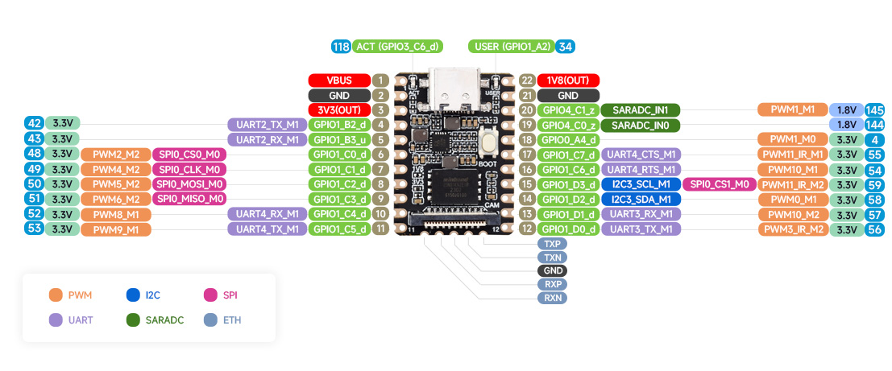
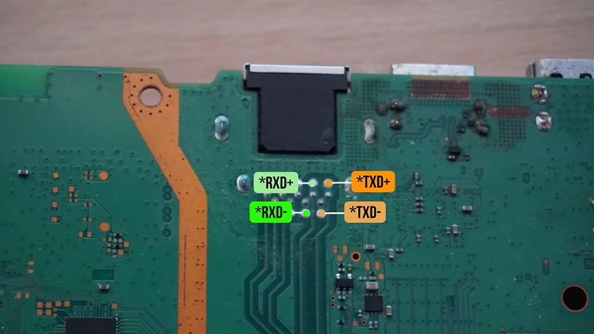
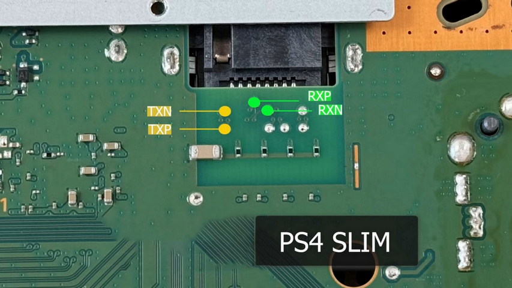
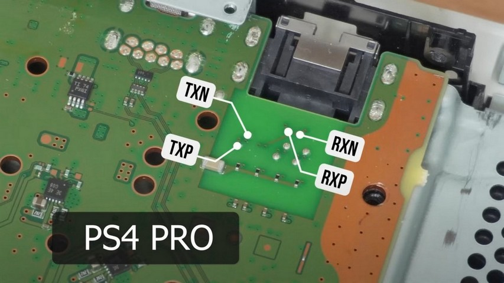
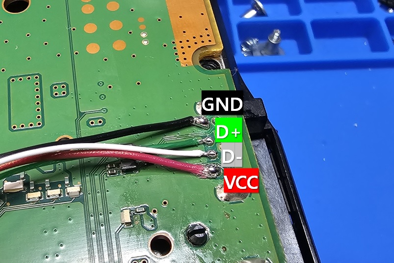

# pOOBs4-Luckfox
Providing pOOBs4 exploit host and some extras with web dasbboard on Luckfox Pico a single board computer.

By emulating USB mass storage for exfathax exploit, Don't bother about plugging in USB stick. All progresses are working automatically!

## Note
**ALL OF USING AT YOUR OWN RESPONSIBILITY**

* pOOBs4 **ONLY** supports PS4 System `9.00`.
* Required to wire or connect both ethernet port and USB port to Luckfox Pico.
* The exploit can be failed sometime. when failed, try again.

## How to install firmware?
* Mini / Plus / P4 Tool  
    https://wiki.luckfox.com/Luckfox-Pico/Luckfox-Pico-MiniB-burn-image
* Pro / Max  
    https://wiki.luckfox.com/Luckfox-Pico/Luckfox-Pico-ProMax-burn-image

**pOOBs4-Luckfox ONLY SUPPORTS SPI NAND FLASHING**

## How to install an internal modchip?
### Luckfox Pico Pinmap

* Ethernet PHY pin is located in bottom (TXP, TXN, TXP, RXN)

### PlayStation 4 Ethernet Pinmap
**!!DO NOT CROSS TX AND RX BETWEEN THE CONSOLE AND LUCKFOX PICO!!**
* Fat (CUH-10xx, CUH-11xx, CUH-12xx)
  
  `RXD+` is alias of `RXP` (Positive), `RXD-` is alias of `RXN` (Negative) 
  `TXD+` is alias of `TXP` (Positive), `TXD-` is alias of `TXN` (Negative) 
  
* Slim (CUH-20xx, CUH-21xx, CUH-22xx)
  

* Pro (CUH-70xx, CUH-71xx, CUH-72xx)
  

### PlayStation 4 USB Pinmap

## How to use it on my PS4?
### Configure Network
* Go to `Settings` and select `Network`.
* Select `Set Up Internet Connection` and choose `Use a LAN Cable`.
* Select `Custom` and choose `Automatic` in IP Address Settings.
* Select `Do Not Specify` in DHCP Host Name.
* Select `Automatic` in DNS Settings.
* Select `Automatic` in MTU Settings.
* Select `Do Not Use` in Proxy Server

### Run Exploit
* Go to `Settings` and select `User's Guide/Helpful Info` and select `User's Guide`.
    *  Or open web browser, go to `http://ps4jb-luckfox.local`
* Click `Exploit` button.
    * `There is not enough free memory` is showing, the exploit is failed.
    * USB mass storage will be plugged int and out automatically by Luckfox Pico.
    * Try again until showing `Done.`.

## How to build it?
* Build firmware first
    * Clone `luckfox-pico` repository
    * Select your Luckfox type by `./build.sh lunch`
    * Configure your build by `./build.sh buildrootconfig`
    * Add pacakages
        * `python3-flask`
        * `dnsmasq` (both DHCP and DNS)
    * Build all by `./build.sh` or build rootfs only by `./build.sh rootfs`
* Install pOOBs4-Luckfox by `./install-to-rootfs-buildroot.sh <rootfs-path>`
    * rootfs path can be found at `<your-luckfox-pico-sdk-path>/output/out/rootfs_uclibc_rv1106`
* Repackage by `./build.sh firmware`
    * Firmware files can be foudn at `<your-luckfox-pico-sdk-path>/output/image`
